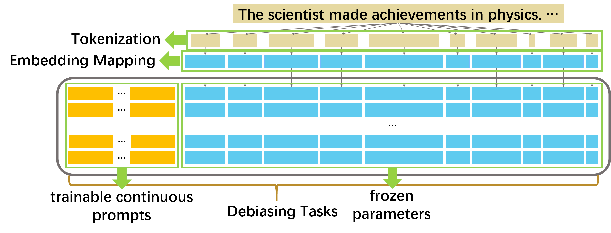

Hello there! I'm Ke Yang (杨可), currently embarking on my first year of pursuing a Ph.D. at UIUC under the guidance of Professor [Chengxiang Zhai](http://czhai.cs.illinois.edu/). I hold a bachelor's degree in Automation from Tsinghua University, where I had the privilege of contributing as a research assistant within Professor [Jie Tang](http://keg.cs.tsinghua.edu.cn/jietang/)'s research group. During the summer of 2022, I had the opportunity to intern with Professor [Heng Ji](http://blender.cs.illinois.edu/hengji.html)'s esteemed group at UIUC.

My academic journey revolves around the captivating realm of natural language processing, with a special fervor for the domains of **intelligent agents**, **language models**, **graph neural networks**, and **multimodality foundation models**. During the winter break of 2022, I orchestrated a collaboration with a team of skilled software engineers. Our collective efforts culminated in the creation of [*Zempath*](#jump), an innovative online social platform that introduces chatbots endowed with distinctive personalities. My attention is also finely attuned to **NLP for societal benefit** and **efficient learning methodologies**.

<h2>Main Publications</h2>
<table cellspacing="0" cellpadding="0">
<tr>
<td style="padding:0px;width:30%;vertical-align:middle">
  
</td>
<td style="padding:20px;width:70%;vertical-align:middle">  
  <h3>Prejudice and Caprice: A Statistical Framework for Measuring Social Discrimination in Large Language Models</h3>
  Yiran Liu*, <b>Ke Yang</b>*, Zehan Qi, Xiao Liu, Yang Yu, Chengxiang Zhai (* indicates equal contributions)
   
  <em>arXiv</em>, 2024
   
  

    <a href="https://arxiv.org/abs/2401.00812">[paper]</a>
  
  
</td>
</tr>  
<tr>
<td style="padding:0px;width:30%;vertical-align:middle">
  
</td>
<td style="padding:20px;width:70%;vertical-align:middle">  
  <h3>If LLM Is the Wizard, Then Code Is the Wand: A Survey on How Code Empowers Large Language Models to Serve as Intelligent Agents</h3>
  <b>Ke Yang</b>*, Jiateng Liu*, John Wu, Chaoqi Yang, Yi R. Fung, Sha Li, Zixuan Huang, Xu Cao, Xingyao Wang, Yiquan Wang, Heng Ji, Chengxiang Zhai  (* indicates equal contributions)
   
  <em>arXiv</em>, 2024
   
  

    <a href="https://arxiv.org/abs/2401.00812">[paper]</a>
  
  
</td>
</tr>  
<tr>
<td style="padding:0px;width:30%;vertical-align:middle">
  
</td>
<td style="padding:20px;width:70%;vertical-align:middle">  
  <h3>ADEPT: A DEbiasing PrompT Framework</h3>
  <b>Ke Yang</b>, Charles Yu, Yi Fung, Manling Li, Heng Ji
   
  <em>AAAI</em>, 2023
   
  

    <a href="https://arxiv.org/abs/2211.05414">[paper]</a>
    <a href="https://github.com/EmpathYang/ADEPT">[code]</a>
    <a href="../files/ADEPT.pdf">[slide]</a>
  
  
</td>
</tr>  
</table>

<h2>
    Zempath
    
</h2>

In the promotional video for Zempath, we unveil our driving inspirations and fundamental principles. We showcase the seamless user experience of engaging in chats, posting either anonymously or under one's real name, indulging in conversations with our personalized chatbots, and forging new connections with like-minded individuals. Let's delve into a snippet from this captivating video:

Miscellaneous
------
Although I was born and raised in Shanghai, China, my true origins trace back to a serene and lesser-known village in Anhui. It's there that my family is the proud custodian of a golden paddy field and a haven for wild geese!

I am an amateur novelist, [painter](/images/hey_you.jpg), and photographer. I take photos of [cats](/images/cat.jpg), [my sister](/images/my_cool_sister.jpg), [grandparents](/images/my_grandparents.jpg), [friends](/images/on_my_21th_birthday.png), [campus](/images/campus.png), etc., in my spare time.
